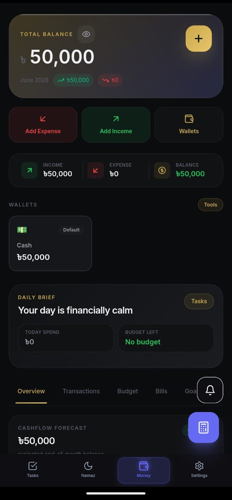
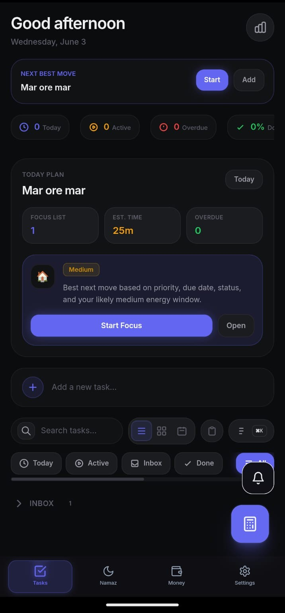
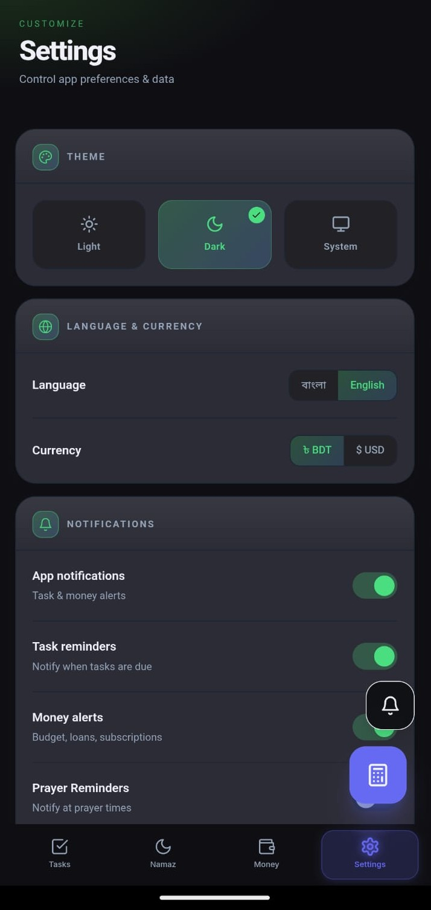
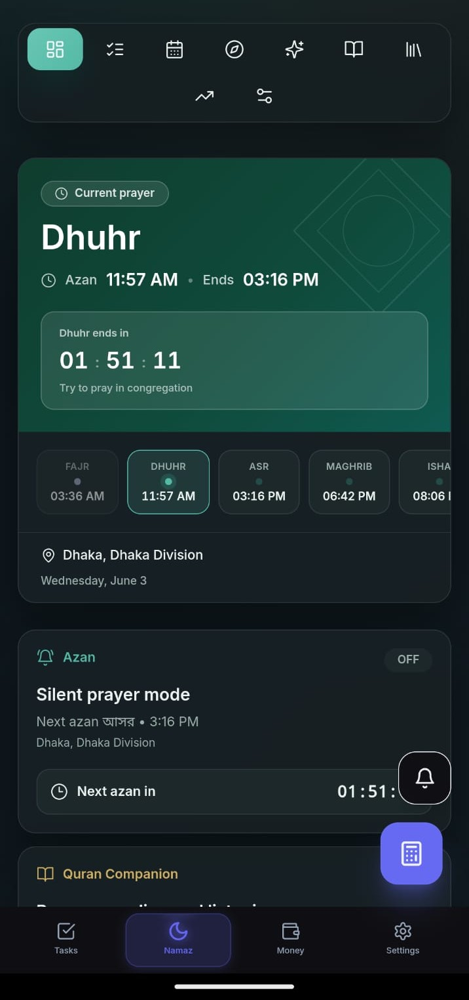

<div align="center">

# 🟧 SelfSync - Personal Life Management App

**A fully local-first personal OS for managing Tasks, Prayer (Namaz), Money, Health, Notes, Zakat & Analytics.**

Built with **Next.js 14 + TypeScript** - works completely offline, stores everything locally, and compiles into a native **Android APK** via Capacitor.

[](https://nextjs.org/)
[](https://www.typescriptlang.org/)
[](https://tailwindcss.com/)
[](https://capacitorjs.com/)
[](https://github.com/pmndrs/zustand)
[](LICENSE)

[Quick Start](#quick-start) • [Build APK](#build-android-apk) • [Project Structure](#project-structure) • [Tech Stack](#tech-stack) • [AI & Voice](#-ai--voice-assistant)

</div>

---

## Table of Contents

- [Overview](#overview)
- [Features](#features)
  - [Home Hub](#-home-hub)
  - [Task Manager](#-task-manager)
  - [Namaz (Prayer) Tracker](#-namaz-prayer-tracker)
  - [Money Manager](#-money-manager)
  - [Analytics & Reports](#-analytics--reports)
  - [App Settings](#-app-settings)
  - [AI & Voice Assistant](#-ai--voice-assistant)
  - [Backup & Sync](#-backup--sync)
- [Tech Stack](#tech-stack)
- [Quick Start](#quick-start)
- [Build Android APK](#build-android-apk)
- [Project Structure](#project-structure)
- [Data Storage](#data-storage)
- [Environment Variables](#environment-variables)
- [Available Scripts](#available-scripts)
- [Screenshots](#screenshots)
- [Contributing](#contributing)
- [License](#license)

---

## Overview

**SelfSync** (previously Amar Zone) is a **local-first** personal productivity and lifestyle management application designed for individuals who want complete control over their data without relying on cloud services.

> **100% Offline-First** - No backend server, no cloud database. All your data stays securely in your device's localStorage. Optional Google Drive sync for backups.
>
> **Web + Mobile** - Runs as a Progressive Web App (PWA) in browsers and compiles into a native Android APK using Capacitor 6.
>
> **Islamic-Friendly** - Built-in prayer time calculations (Adhan library), Qibla direction compass, Quran viewer with media playback, Tasbih counter, Dua collection, Ramadan/Travel modes, Azan audio reminders, and Zakat calculator.
>
> **AI-Powered** - Voice command assistant with Groq AI integration, smart task planning, and intent-based automation.
>
> **P2P Sync** - Peer-to-peer data transfer via WebRTC (PeerJS) for offline device-to-device synchronization.

---

## Features

### 🏠 Home Hub

A centralized dashboard that brings together all modules in one place:

| Feature | Description |
|---------|-------------|
| **Dashboard View** | Summary cards showing task stats, prayer progress, financial health, and quick insights |
| **Floating Action Button** | Draggable quick-action button for instant task creation and navigation |
| **Notes** | Rich markdown notes system with QuickNoteWidget for fast capture, trash/archive management |
| **Health (BMI)** | Calculate Body Mass Index with health category classification |
| **Zakat Calculator** | Step-by-step wizard for calculating Zakat based on gold, silver, cash savings, market prices, and nisab method selection |
| **Quick Actions** | Smart morning dashboard with daily routine shortcuts |

The Home tab serves as the landing hub with lazy-loaded sub-tabs for optimal performance.

---

### ✅ Task Manager

A powerful task management system with focus tools and multiple views:

| Feature | Description |
|---------|-------------|
| **Create & Edit Tasks** | Add tasks with title, description, category, and priority |
| **Categories** | Work, Study, Personal, Health, Other |
| **Priority Levels** | High, Medium, Low |
| **Recurring Tasks** | Daily, Weekly, or Monthly repetition |
| **Pomodoro Timer** | Built-in focus timer (25 min work + break cycles) |
| **Task Streaks** | Track completion streaks for habit building |
| **Due Dates** | Set deadlines with date picker |
| **Archive System** | Archive completed/old tasks without deleting |
| **Multiple Views** | List view, Board view (Kanban), Timeline view |
| **Quick Add** | Floating action button for instant task creation |
| **Dashboard Sheet** | Bottom sheet dashboard with stats, weekly review, and next task |
| **Smart Plan** | AI-powered daily planning suggestions and prioritization |
| **Today Plan** | Focus on today's prioritized tasks |
| **Weekly Review** | Reflect on weekly accomplishments |
| **Productivity Heatmap** | Visual heatmap showing task activity patterns over time |
| **Bulk Actions** | Batch edit, delete, or move tasks |
| **Command Palette** | Quick keyboard commands for power users |
| **Context Menu** | Right-click / long-press context actions |
| **Onboarding Overlay** | Guided tour for first-time users |
| **Advanced Filtering** | Filter by status, priority, category, date range |
| **Focus Card** | Dedicated card view for focused work on a single task |
| **Smart Planning Section** | AI-organized task groupings for efficient daily planning |

**Task Status Flow:**
`
Backlog -> Today -> In Progress -> Done -> Archived
`

---

### 🕌 Namaz (Prayer) Tracker

Complete Islamic prayer management with spiritual tools and special modes:

| Feature | Description |
|---------|-------------|
| **5 Waqt Prayer Times** | Automatic calculation for Fajr, Dhuhr, Asr, Maghrib, Isha using the Adhan library |
| **Prayer Status** | Mark each prayer as: Pending / Prayed / Missed / Qaza |
| **Heatmap Calendar** | Visual calendar showing prayer consistency over time |
| **Qibla Compass** | Direction indicator towards Mecca |
| **Location-Based** | Auto-detects location via Capacitor Geolocation for accurate timings |
| **Adhan Audio Reminders** | Native Azan audio playback with foreground service and alarm scheduling |
| **Notification Support** | Local push notifications via Capacitor Local Notifications |
| **Quran Viewer** | Browse and read Quran with chapter navigation and audio media playback |
| **Quran Media Player** | Full media notification controls (play, pause, next, previous) for Quran audio |
| **Tasbih Counter** | Digital counter for dhikr (remembrance of Allah) |
| **Dua Collection** | Categorized duas for various occasions |
| **Prayer Insights** | Analytics on prayer consistency, trends, and monthly stats |
| **Azan & Jamat Config** | Customizable Azan and Jamat time configuration panel |
| **Wudu Timer** | Track wudu (ablution) duration with timer |
| **Quick Actions** | Quick access to Quran, Qibla, Tasbih, Dua, and Wudu timer |

**Special Modes:**

| Mode | Features |
|------|----------|
| **🌙 Ramadan Mode** | Iftar countdown, Fasting tracker, Taraweeh tracker, Ramadan special duas |
| **✈️ Travel Mode** | Adjusted prayer timings and rules for travelers (Qasr/Jam) |
| **🔄 Combined Mode** | Smart combination of prayer timings based on travel conditions |
| **📅 Next Ramadan** | Countdown to next Ramadan with preparation checklist |

| Feature | Description |
|---------|-------------|
| **Preferences** | Configure calculation method (Karachi, Makkah, ISNA, etc.), madhab, and time adjustments |
| **More Sheet** | Extended tools and additional features bottom sheet |
| **Swipe Navigation** | Smooth horizontal swipe between Namaz dashboard views |

---

### 💰 Money Manager

Comprehensive personal finance tracking with budgeting and wealth management tools:

| Feature | Description |
|---------|-------------|
| **Income & Expense Tracking** | Log transactions with categories and notes |
| **Expense Categories** | Food, Transport, Utilities, Health, Education, Entertainment, Shopping, Rent, Other |
| **Income Categories** | Salary, Freelance, Investment, Gift, Other |
| **Wallets** | Multiple wallets: Cash, Bank, Mobile, Savings |
| **Loan Manager** | Track money Given vs Taken with repayment history |
| **Monthly Budget** | Set budget limits per category with progress tracking |
| **Savings Goals** | Create goals with target amounts and deadlines |
| **Subscriptions** | Track recurring subscriptions (Netflix, Spotify, etc.) with renewal dates |
| **Financial Insights** | Smart warnings, tips, and spending trend analysis |
| **Transaction Status** | Completed / Pending / Cancelled |
| **Tags & Filtering** | Add custom tags and filter transactions |
| **PDF Export** | Generate downloadable financial reports |
| **Spending Pulse** | Real-time spending activity indicator |
| **Quick Transaction** | Fast transaction logging widget |

**Premium Features (Wealth Hub):**

| Feature | Description |
|---------|-------------|
| **WealthHub** | Advanced net worth tracking with asset/liability breakdown |
| **ActivityFeed** | Detailed chronological feed of all financial activities |
| **SmartMorningDashboard** | Daily financial summary with smart morning briefing |

---

### 📊 Analytics & Reports

Visual insights across all modules:

| Feature | Description |
|---------|-------------|
| **Expense Charts** | Bar, Line, and Pie charts for spending analysis (Recharts) |
| **Task Trends** | Completion rate trends over time |
| **Time Range Filters** | Week / Month / Quarter / Year views |
| **PDF Export** | Generate monthly PDF reports using jsPDF + AutoTable |
| **Prayer Heatmap** | Consistency visualization for Namaz |
| **Financial Summaries** | Income vs Expense balance cards with net worth |

---

### ⚙️ App Settings

Personalization, security, and data management:

| Feature | Description |
|---------|-------------|
| **Theme** | Light / Dark / System mode with smooth transitions |
| **Language** | English (EN) / Bengali (BN) |
| **Currency** | BDT / USD / EUR |
| **PIN Lock** | 4-6 digit PIN for app security |
| **Biometric Lock** | Fingerprint/Face ID via Capacitor Native Biometric |
| **Google Drive Backup** | Backup/restore data to Google Drive (OAuth 2.0) with encrypted App Data folder |
| **JSON Export/Import** | Manual encrypted backup/restore as JSON file |
| **Auto Backup Scheduler** | Configure automatic periodic backups at set intervals |
| **Backup Manager** | Dialog interface for managing backup operations and history |
| **Notification Center** | Centralized view of all app notifications and reminders |
| **Onboarding** | First-time user tutorial with step-by-step guide |
| **Cloud Sync Card** | Interface for managing Google Drive sync status and operations |

---

### 🎤 AI & Voice Assistant

Intelligent voice-powered assistant with natural language understanding:

| Feature | Description |
|---------|-------------|
| **Voice Commands** | Speech-to-text for creating tasks, logging expenses, and more |
| **Groq AI Integration** | High-speed LLM inference for intent processing and smart responses |
| **Intent Parser** | Extract structured data from natural language commands |
| **Command Registry** | Extensible command system for all app modules |
| **Text-to-Speech** | Voice feedback and responses via speech synthesis |
| **Voice Activity Detection (VAD)** | Smart listening with silence detection and auto-stop |
| **Smart Task Planning** | AI-assisted daily task organization and prioritization |
| **Floating Voice Button** | Always-accessible microphone button for quick voice commands |

**Example Commands:**
- "Add a task to buy groceries tomorrow at 5pm"
- "Log 500 taka for lunch"
- "What's my task completion rate this week?"

---

### 💾 Backup & Sync

Multi-layered data protection and synchronization:

| Feature | Description |
|---------|-------------|
| **Google Drive Backup** | Encrypted backup to Google Drive App Data folder (4.0+) |
| **JSON Export/Import** | Manual backup with optional AES encryption |
| **Auto Scheduler** | Configurable automatic backup intervals (daily, weekly, monthly) |
| **Backup Validator** | Validate backup integrity before restore |
| **Backup Merger** | Merge multiple backups intelligently to recover maximum data |
| **Backup Collector** | Comprehensive collection of all app state for backup |
| **WebRTC P2P Sync** | Peer-to-peer data transfer between devices (PeerJS) with QR code pairing |
| **Quick Transfer Dialog** | Easy-to-use interface for initiating P2P transfers |
| **Sync Engine** | Conflict resolution and data merge during synchronization |
| **Sync Encryption** | AES encryption for in-transit sync data |
| **Post-Sync Rehydration** | Seamless state restoration after sync completes |
| **Google Auth Integration** | OAuth 2.0 with scoped Drive access for secure cloud backup |

---

## Tech Stack

### Core Framework
| Technology | Version | Purpose |
|------------|---------|---------|
| **Next.js** | 14.2 | React framework with App Router & static export |
| **React** | 18 | UI library |
| **TypeScript** | 5.0 | Type safety & developer experience |
| **Tailwind CSS** | 3.4 | Utility-first styling with custom design system |
| **PostCSS** | 8 | CSS processing |
| **Autoprefixer** | 10 | CSS vendor prefixes |

### State Management & Storage
| Technology | Version | Purpose |
|------------|---------|---------|
| **Zustand** | 4.5 | Lightweight, scalable state management |
| **localStorage** | - | Persistent offline data storage (no backend) |
| **pako** | 2.1 | Data compression for backups |

### UI & Animation
| Technology | Version | Purpose |
|------------|---------|---------|
| **Framer Motion** | 12.40 | Smooth animations & gesture-driven transitions |
| **Lucide React** | 0.383 | Modern, consistent icon library |
| **clsx** | 2.1 | Conditional class name composition |
| **tailwind-merge** | 2.3 | Tailwind class conflict resolution |

### Charts & Visualization
| Technology | Version | Purpose |
|------------|---------|---------|
| **Recharts** | 2.12 | Interactive charts (Bar, Line, Pie, Area) |

### PDF & Export
| Technology | Version | Purpose |
|------------|---------|---------|
| **jsPDF** | 2.5 | PDF document generation |
| **jsPDF-AutoTable** | 3.8 | Table formatting in PDF exports |

### Date & Islamic Utilities
| Technology | Version | Purpose |
|------------|---------|---------|
| **date-fns** | 3.6 | Date formatting, manipulation & localization |
| **adhan** | 4.4 | Accurate Islamic prayer time calculations |

### QR & Barcode
| Technology | Version | Purpose |
|------------|---------|---------|
| **qrcode** | 1.5 | QR code generation for sharing & P2P pairing |
| **@zxing/browser** | 0.1 | Barcode/QR scanning via camera |

### AI & Voice
| Technology | Version | Purpose |
|------------|---------|---------|
| **Groq SDK** | - | High-speed LLM inference for voice intent processing |
| **Web Speech API** | - | Speech recognition & synthesis (built-in) |

### P2P Sync
| Technology | Version | Purpose |
|------------|---------|---------|
| **PeerJS** | 1.5 | WebRTC peer-to-peer data transfer |

### Mobile / APK Build
| Technology | Version | Purpose |
|------------|---------|---------|
| **@capacitor/core** | 6.0 | Native mobile runtime bridge |
| **@capacitor/android** | 6.0 | Android platform support |
| **@capacitor/cli** | 6.0 | Capacitor command-line tools |
| **@capacitor/geolocation** | 6.0 | GPS location for prayer time accuracy |
| **@capacitor/haptics** | 6.0 | Haptic feedback for interactions |
| **@capacitor/local-notifications** | 6.0 | Local push notifications |
| **@capgo/capacitor-native-biometric** | 6.0 | Fingerprint & Face ID authentication |
| **@codetrix-studio/capacitor-google-auth** | 3.4 | Google Sign-In & Drive backup integration |

### Development Tools
| Technology | Version | Purpose |
|------------|---------|---------|
| **ESLint** | 8 | Code linting & quality |
| **eslint-config-next** | 14.2 | Next.js-specific lint rules |

---

## Quick Start

### Prerequisites
- **Node.js** 18+
- **npm** or **yarn**
- (Optional) **Android Studio** for APK build

### Installation

```bash
# 1. Clone the repository
git clone https://github.com/ahmed-jishan/amar-zone-dev.git
cd amar-zone-dev

# 2. Install dependencies
npm install

# 3. Start the development server
npm run dev

# 4. Open in browser
# -> http://localhost:3000
```

The app will automatically redirect to the Home dashboard on first load.

---

## Build Android APK

### Requirements
- [Android Studio](https://developer.android.com/studio) installed
- Java 17+
- Android SDK

### Build Steps

```bash
# Step 1: Create optimized static build
npm run build

# Step 2: Add Android platform (first time only)
npm run cap:add:android

# Step 3: Sync web assets to Android project
npm run cap:sync

# Step 4: Open Android Studio
npm run cap:open:android

# Step 5: In Android Studio -> Build -> Generate Signed Bundle/APK
```

> Tip: The cap:sync script automatically patches Google Auth scopes, ensures Android permissions, generates app icons, and validates environment variables.

---

## Project Structure

```
amar-zone/
├── src/
│   ├── app/                              # Next.js App Router
│   │   ├── layout.tsx                   # Root layout (fonts, metadata, theme provider)
│   │   ├── page.tsx                     # Landing page -> redirects to /(tabs)/home
│   │   ├── (tabs)/                     # Tab-based navigation layout
│   │   │   ├── layout.tsx               # Bottom navigation bar (mobile-optimized)
│   │   │   ├── home/                    # Home Hub (Dashboard, Notes, Health, Zakat)
│   │   │   ├── tasks/                   # Task Manager
│   │   │   ├── namaz/                   # Namaz Tracker
│   │   │   ├── money/                   # Money Manager
│   │   │   ├── analytics/               # Analytics & Reports
│   │   │   └── settings/                # App Settings
│   │   └── api/                         # API routes (Google Drive OAuth, Backup)
│   │
│   ├── features/                        # Feature modules (domain-driven)
│   │   ├── home/                        # Home tab with Dashboard, tabs management
│   │   ├── tasks/                       # Tasks CRUD, Board, Timeline, Pomodoro, Streaks
│   │   ├── namaz/                       # Prayer times, Qibla, Quran, Tasbih, Dua, Insights, Modes
│   │   ├── money/                       # Transactions, Loans, Wallets, Budgets, Goals, WealthHub
│   │   ├── analytics/                   # Charts, reports, PDF export
│   │   ├── settings/                    # Theme, language, security, backup, sync
│   │   ├── notes/                       # Markdown notes (create, edit, delete, archive)
│   │   ├── health/                      # BMI Calculator
│   │   └── zakat/                       # Zakat calculation wizard (gold, silver, cash)
│   │
│   ├── components/                      # Shared UI components
│   │   ├── ui/                          # Atomic: Button, Input, Badge, Card, Modal, Calculator
│   │   ├── shared/                      # Layout: TabsShell, ErrorBoundary, PageHeader
│   │   ├── settings/                    # Settings components (BackupManager, CloudSync)
│   │   ├── splash/                      # Splash screen & app initialization
│   │   └── sync/                        # P2P sync UI components
│   │
│   ├── lib/                             # Core libraries & utilities
│   │   ├── types/                       # TypeScript interfaces & type definitions
│   │   ├── store/                       # Zustand stores (persisted to localStorage)
│   │   ├── hooks/                       # Custom React hooks (useTheme, useDraggable, etc.)
│   │   ├── utils/                       # Utility functions (compress, encrypt, PDF export)
│   │   ├── native/                      # Capacitor native bridge wrappers
│   │   ├── voice/                       # Voice command system (VAD, Groq, TTS, STT)
│   │   ├── ai/                          # AI integration (orchestrator, intent processing)
│   │   ├── sync/                        # Data synchronization (sync engine, WebRTC, crypto)
│   │   ├── backup/                      # Backup system (collector, serializer, validator, restorer, merger)
│   │   ├── server/                      # Server-side utilities (Google Drive API)
│   │   └── startup/                     # Application startup & storage repair
│   │
│   └── types/                           # Global type declarations
│
├── public/
│   ├── manifest.json                    # PWA manifest
│   ├── icons/                           # App icons (192x192, 512x512)
│   └── sounds/                          # Adhan audio files
│
├── scripts/                             # Build & automation scripts
├── screenshots/                         # App screenshots for README
├── android/                             # Android native project (Capacitor)
├── next.config.mjs                      # Static export config for Capacitor
├── tailwind.config.ts                   # Tailwind theme (brand colors, animations)
├── tsconfig.json                        # TypeScript configuration
├── capacitor.config.ts                  # Capacitor config (appId, plugins, Google Auth)
├── postcss.config.js                    # PostCSS configuration
├── package.json                         # Dependencies & scripts
└── GOOGLE_AUTH_FIX.md                   # Google Auth troubleshooting guide
```

---

## Data Storage

All data is stored **locally** in the browser's localStorage. No data leaves your device unless you explicitly use Google Drive backup or P2P sync.

| localStorage Key | Module | Data Type |
|------------------|--------|-----------|
| amar-zone-tasks | Task Manager | Tasks, streaks, pomodoro history |
| amar-zone-namaz | Namaz Tracker | Prayer records, settings, location |
| amar-zone-money | Money Manager | Transactions, loans, wallets, budgets, goals |
| amar-zone-settings | App Settings | Theme, language, currency, PIN, biometric |
| amar-zone-notes | Notes | Markdown notes collection |
| amar-zone-zakat | Zakat Calculator | Gold/silver prices, savings data |
| amar-zone-health | Health | BMI records |

> Backup: Use Settings -> Google Drive Backup or JSON Export/Import to prevent data loss.
>
> Security: PIN lock and Biometric authentication (Fingerprint/Face ID) available for app access control.
>
> Sync: Use P2P Quick Transfer to sync data between devices without any cloud server.

---

## Environment Variables

Create a .env.local file in the root directory for optional integrations:

```env
# Google OAuth (for Drive Backup & Sign-In)
NEXT_PUBLIC_GOOGLE_WEB_CLIENT_ID=your_web_client_id.apps.googleusercontent.com
NEXT_PUBLIC_GOOGLE_ANDROID_CLIENT_ID=your_android_client_id.apps.googleusercontent.com

# Groq AI (for Voice Assistant)
NEXT_PUBLIC_GROQ_API_KEY=your_groq_api_key
```

> Note: These are only required for optional features (Google Drive backup & Voice AI assistant). The app works fully offline without them.

---

## Available Scripts

| Script | Description |
|--------|-------------|
| npm run dev | Start development server (with .next cleanup) |
| npm run build | Create optimized production static build (with validation) |
| npm run start | Start production server |
| npm run lint | Run ESLint code quality checks |
| npm run icons | Generate app icons for Android |
| npm run cap:add:android | Add Android platform to project (first time) |
| npm run cap:sync | Sync web build to Android + patch permissions + generate icons |
| npm run cap:open:android | Open project in Android Studio |
| npm run postinstall | Auto-patch Google Auth Drive scope after install |

---

## Screenshots

<p float="left">
  <a href="screenshots/money.jpeg">
    
  </a>

  <a href="screenshots/tasks.jpeg">
    
  </a>

  <a href="screenshots/settings.jpeg">
    
  </a>

  <a href="screenshots/namaz.jpeg">
    
  </a>
</p>

---

## Contributing

Contributions are welcome! Please feel free to submit a Pull Request.

1. Fork the repository
2. Create your feature branch (git checkout -b feature/AmazingFeature)
3. Commit your changes (git commit -m 'Add some AmazingFeature')
4. Push to the branch (git push origin feature/AmazingFeature)
5. Open a Pull Request

### Development Guidelines
- Follow the existing code structure and naming conventions
- Use TypeScript for all new code
- Ensure all data is stored locally via Zustand + localStorage
- Test both web (PWA) and Android (Capacitor) environments

---

## License

This project is licensed under the **MIT License** - see the LICENSE file for details.

---

<div align="center">

**Made with ❤️ by [Ahmed Jishan](https://github.com/ahmed-jishan)**

Star this repo if you find it helpful!

---

*Built with Next.js, TypeScript, Tailwind CSS & Capacitor - 100% local-first, always offline-ready.*

</div>